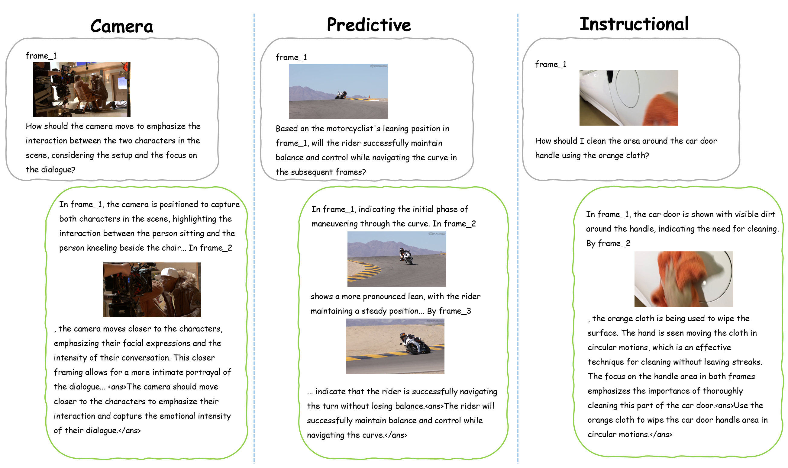

# TwiFF (Think With Future Frames): A Large-Scale Dataset for Dynamic Visual Reasoning
<p align="center">
  <a href="https://arxiv.org/abs/2602.10675">
    
  </a>
  <a href="https://huggingface.co/Liu-Junhua/TwiFF-7B">
    
  </a>
  <a href="https://huggingface.co/datasets/Liu-Junhua/TwiFF-2.7M">
    
  </a>
  <a href="https://huggingface.co/datasets/Liu-Junhua/TwiFF-Bench">
    
  </a>
</p>
🌟  This is the official repository which contains the training and inference code for TwiFF.

## 📢 News
- **Feb 12, 2026:** Our model checkpoint, training data and benchmark are now accessible at [Huggingface](https://huggingface.co/collections/Liu-Junhua/twiff).
- **Feb 12, 2026:** Our paper is now accessible at [arxiv](https://arxiv.org/abs/2602.10675)
- **Feb 12, 2026:** We have provided a training guideline in [TRAIN](./README.md#-train).

## 🧠 Method

<p align="center"></p>
We present TwiFF, a unified model fine-tuned on a high-quality dynamic visual Chain-of-Thought (VCoT) dataset comprising 2.7 million samples. In dynamic multimodal question-answering tasks involving instructional, predictive, and camera, TwiFF iteratively generates future event frames alongside textual reasoning, thereby producing temporally coherent visual reasoning trajectories. Experimental results demonstrate that, on dynamic scenario reasoning benchmarks, our dynamic VCoT approach outperforms both static VCoT methods based on tool-calling paradigms and purely textual chain-of-thought baselines.

## 🚀 Quick Start

1. **Set up environment**

   ```bash
   git clone https://github.com/LiuJunhua02/TwiFF.git
   cd TwiFF
   conda create -n TwiFF python=3.10 -y
   conda activate TwiFF
   pip install -r requirements.txt
   pip install flash_attn==2.5.8 --no-build-isolation
   ```

2. **Download checkpoint**

   ```python
   from huggingface_hub import snapshot_download

   save_dir = "models/TwiFF-7B"
   repo_id = "Liu-Junhua/TwiFF-7B"
   cache_dir = save_dir + "/cache"

   snapshot_download(cache_dir=cache_dir,
     local_dir=save_dir,
     repo_id=repo_id,
     local_dir_use_symlinks=False,
     resume_download=True,
     allow_patterns=["*.json", "*.safetensors", "*.bin", "*.py", "*.md", "*.txt"],
   )
   ```

3. **Store your test cases in `output/demo.jsonl` following the format below:**

   ```json
   {"prompt": "frame_1\n<image>\nI am making chocolate sauce for the cake, what should I do next?", "img_path": ["/path/to/image"]}
   {"prompt": "frame_1\n<image>\nHow should a photographer move the camera to better emphasize the flock of chickens on the grass?", "img_path": ["/path/to/image"]}
   ```

4. **Start Inference**

   ```bash
   python \
     scripts/inference.py \
     --max_round 8 \
     --model_dir models/TwiFF-7B \
     --checkpoint_file model.safetensors \
     --checkpoint_dir models/TwiFF-7B \
     --QA_file output/demo.jsonl \
     --seed 42
   ```

## 🔥 Train

### Data Prepration

1. **Download the training dataset**

   ```python
    from datasets import load_dataset
    # TwiFF-2.7M w/o video & images
    dataset = load_dataset("Liu-Junhua/TwiFF-2.7M", split="train")
   ```

2. **Download the video clips**

   All video clips in TwiFF-2.7M are sourced from Panda-70M, please refer to Panda-70M offical data download instructions mentioned [here](https://github.com/snap-research/Panda-70M/tree/main/dataset_dataloading).

   The original video height for all data in TwiFF-2.7M is 720px, please change the `download_size` in [panda70m.yaml](https://github.com/snap-research/Panda-70M/blob/main/dataset_dataloading/video2dataset/video2dataset/configs/panda70m.yaml) to 720.

3. **Convert the downloaded dataset into JSONL format suitable for model training.**
   `video_think_dataset.py` reads the TwiFF-2.7M data from a JSONL file and directly extracts key frames from videos during the training, so you don't need to pre-store key frames for all samples. Please prepare your `TwiFF-2_7M_data.jsonl` file in the following format:

   ```json
   {
   "video": "/path/to/video_clip.mp4", 
   "frames": [1], 
   "recon_frames": [3, 6], 
   "conversations": [
         {"from": "system", "value": "{system prompt}"}, 
         {"from": "human", "value": "frame_1\n<image>\n{question}"}, 
         {"from": "gpt", "value": "{resoning_thought_0}\n<rimage>\n{resoning_thought_1}\n<rimage>\n{resoning_thought_2}\n<ans>{answer}</ans>"}
      ]
   }
   ```

   <details>
   <summary>Key meaning</summary>

   - `video`: video clip path
   - `frames`: a list of input images (key frame indices 1~8)
   - `recon_frames`: a list of generation images (key frame indices 1~8)
   - `conversations`: question and answer. `<image>` denotes the input image placeholder, `<rimage>` denotes the output image placeholder

   </details>

4. **Edit `data/dataset_info.py` and `configs/UniCOT.yaml` with your own data & video path.**

### Training

We provide script examples for TwiFF training settings in our paper, in `./train_scripts`. You can train with:

```bash
sh train_scripts/Stage1.sh
```

You can replace the variables in the script with your own before running. See Bagel's [TRAIN](https://github.com/ByteDance-Seed/Bagel/blob/main/TRAIN.md) for more details.

## 🧪 Eval

We provide the scripts for evaluating TwiFF-Bench in and Seed-Bench-R1 in [`./eval`](./eval/).

### TwiFF-Bench

1. **Download the benchmark dataset**

   ```python
    from datasets import load_dataset
    # TwiFF-Bench with images
    dataset = load_dataset("Liu-Junhua/TwiFF-Bench", split="test")
   ```

2. **Download the video clips**
   Although images are provided in TwiFF-Bench, we still recommend downloading the video files. If you wish to use images directly, please modify the data loading method in [`inference_benchmark_TwiFF_mp.py`](./eval/TwiFFBench/inference_benchmark_TwiFF_mp.py) and [`gencot_vqa_eval.py`](./eval/TwiFFBench/gencot_vqa_eval.py).

   All video clips in TwiFF-Bench are sourced from Panda-70M, please refer to Panda-70M offical data download instructions mentioned [here](https://github.com/snap-research/Panda-70M/tree/main/dataset_dataloading).

   The original video height for all data in TwiFF-Bench is 720px, please change the `download_size` in the [panda70m.yaml](https://github.com/snap-research/Panda-70M/blob/main/dataset_dataloading/video2dataset/video2dataset/configs/panda70m.yaml) to 720.

3. **Convert the downloaded dataset into JSONL format suitable for evaluation.**
   Evaluation code reads the TwiFF-Bench data from a JSONL file and directly extracts key frames from videos during the training, so you don't need to pre-store key frames for all samples. Please prepare your `TwiFF-Bench.jsonl` file in the following format:

   ```json
   {
   "video": "/path/to/video_clip.mp4", 
   "frames": [1], 
   "recon_frames": [3, 6], 
   "question": "frame_1\n<image>\n{question}",
   "answer": "{resoning_thought_0}\n<rimage>\n{resoning_thought_1}<ans>{answer}</ans>"
   }
   ```

   <details>
   <summary>Key meaning</summary>

   - `video`: video clip path
   - `frames`: a list of input images (key frame indices 1~8)
   - `recon_frames`: a list of generation images (key frame indices 1~8)
   - `question`: question. `<image>` denotes the input image placeholder
   - `answer`: answer. `<rimage>` denotes the output image placeholder

   </details>

4. **Generate TwiFF Response**

      ```bash
      cd eval/TwiFFBench

      MAX_ROUND=8 \
      WORLD_SIZE=8 \
      NUM_GPUS=8 \
      MODEL_DIR="/path/to/TwiFF-7B"
      CHECKPOINT_FILE="model.safetensors" \
      CHECKPOINT_DIR="/path/to/TwiFF-7B" \
      OUTPUT_DIR="/path/to/result_dir" \
      ROOT_PATH="/path/to/TwiFF-Bench_video" \
      QA_FILE="/path/to/TwiFF-Bench.jsonl" \
      ./gen_TwiFF.sh
      ```

    <details>
      <summary>Key meaning</summary>

      - `MAX_ROUND`: maximum number of cycles for interleaved text and images
      - `WORLD_SIZE`: number of inference workers (distribute evenly across all GPUs)
      - `NUM_GPUS`: number of available GPUs
      - `MODEL_DIR`: path to TwiFF checkpoint directory
      - `CHECKPOINT_FILE`: path to TwiFF checkpoint file
      - `CHECKPOINT_DIR`: path to TwiFF checkpoint directory
      - `OUTPUT_DIR`: results directory
      - `ROOT_PATH`: path to TwiFF video directory
      - `QA_FILE`: benchmark file

    </details>

      The `model_response` in `model_response_unscore.jsonl` is a list ['resoning_thought_0', '/path/to/img_1.png', 'resoning_thought_1', ..., 'answer']

      The results directory structure is:

      ```shell
      result_dir/
      ├── model_response_unscore.jsonl
      └── images/
            ├── reasoning_1_image_2.png
            └── ...
      ```

5. **Response Evaluation**
    Pelase modify `DATA_PATHS` and `OUT_PATHS` in [`gencot_vqa_eval.py`](./eval/TwiFFBench/benchmark_eval.sh) to the paths of your response and evaluation result files. Use the following scripts to get the score:

      ```bash
      API='https://openrouter.ai/api/v1' \
      API_KEY='Put your APIKEY here' \
      MODEL_NAME="openai/gpt-5.1" \
      ROOT_PATH='/path/to/TwiFF-Bench_video' \
      REQ_SIZE=16 \
      BATCH_SIZE=1 \
      OUT_FREQ=32 \
      MAX_TOKENS=512 \
      NUM_WORK=16 \
      eval/TwiFFBench/benchmark_eval.sh
      ```

    <details>
      <summary>Key meaning</summary>

      - `API`: api url
      - `API_KEY`: your api key
      - `MODEL_NAME`: judge model name
      - `ROOT_PATH`: video clip directory
      - `REQ_SIZE`: number of async requests
      - `BATCH_SIZE`: number of data samples preloaded per worker.
      - `OUT_FREQ`: frequence write to jsonl
      - `MAX_TOKENS`: judge max response tokens
      - `NUM_WORK`: number of dataloader workers

    </details>

    The `score` in `model_response_score_gpt.jsonl` is a list containing two elements:[{cot_score}, {ans_score}]

### Seed-Bench-R1

1. **Download the benchmark dataset**
   Please download the original [Seed-Bench-R1](https://huggingface.co/datasets/TencentARC/SEED-Bench-R1) dataset, and use the validation spilt (`validation_L1.jsonl`, `validation_L2.jsonl
`, `validation_L3.jsonl`).

2. **Convert the downloaded dataset into JSONL format suitable for evaluation.**
   Please unzip the images in Seed-Bench-R1 and prepare your `Seed-Bench-R1.jsonl` file in the following format:

   ```json
   {
      "sample_id": "{sample_id}", 
      "domain": "{domain}", 
      "scenario": "{scenario}",
      "task_goal": "{task_goal}",
      "choice_a": "{choice_a}",
      "choice_b": "{choice_b}",
      "choice_c": "{choice_c}",
      "choice_d": "{choice_d}",
      "golden_choice_idx": "A/B/C/D",
      "answer": "{answer}",
      "task_start_frame": "{task_start_frame}",
      "task_progress_metadata": ["metadata"],
      "video_id": "{video_id}",
      "video_source": "Ego4D/EpicKitchens",
      "question": "{question}",
      "video_basename": "{id}.mp4",
      "current_observation_basename": "{id}.png",
      "task_level": "L1/L2/L3",
   }
   ```

3. **Generate TwiFF Response**

      ```bash
      cd eval/SeedBenchR1

      MAX_ROUND=8 \
      WORLD_SIZE=8 \
      NUM_GPUS=8 \
      CHECKPOINT_FILE="model.safetensors" \
      CHECKPOINT_DIR="/path/to/TwiFF-7B" \
      OUTPUT_DIR="/path/to/result_dir_SBR1" \
      ROOT_DIR="/path/to/bench_dir" \
      QA_FILE="/path/to/Seed-Bench-R1.jsonl" \
      DIS_OPT=1 \
      ./gen_SeedBenchR1_TwiFF.sh
      ```

    <details>
      <summary>Key meaning</summary>

      - `MAX_ROUND`: maximum number of cycles for interleaved text and images
      - `WORLD_SIZE`: number of inference workers (distribute evenly across all GPUs)
      - `NUM_GPUS`: number of available GPUs
      - `MODEL_DIR`: path to TwiFF checkpoint directory
      - `CHECKPOINT_FILE`: path to TwiFF checkpoint file
      - `CHECKPOINT_DIR`: path to TwiFF checkpoint directory
      - `OUTPUT_DIR`: results directory
      - `ROOT_PATH`: path to Seed-Bench-R1 directory
      - `QA_FILE`: benchmark file
      - `DIS_OPT`: use open-ended question-answer (1: open-ended, 0: multiple-choice)

    </details>

      The `model_response` in `model_response_unscore.jsonl` is a list ['resoning_thought_0', '/path/to/img_1.png', 'resoning_thought_1', ..., 'answer']

      The results directory structure is:

      ```shell
      result_dir_SBR1/
      ├── model_response_unscore.jsonl
      └── images/
            ├── reasoning_1_image_2.png
            └── ...
      ```

4. **Response Evaluation**
    Pelase modify `DATA_PATHS` and `OUT_PATHS` in [`gencot_vqa_eval.py`](./eval/SeedBenchR1/SeedBenchR1_eval.sh) to the paths of your response and evaluation result files. Use the following scripts to get the score:

      ```bash
      API='https://openrouter.ai/api/v1' \
      API_KEY='Put your APIKEY here' \
      MODEL_NAME="openai/gpt-5.1" \
      ROOT_PATH='/path/to/TwiFF-Bench_video' \
      REQ_SIZE=16 \
      BATCH_SIZE=1 \
      OUT_FREQ=32 \
      MAX_TOKENS=512 \
      NUM_WORK=16 \
      eval/SeedBenchR1/benchmark_eval.sh
      ```

    <details>
      <summary>Key meaning</summary>

      - `API`: api url
      - `API_KEY`: your api key
      - `MODEL_NAME`: judge model name
      - `ROOT_PATH`: benchmark directory
      - `REQ_SIZE`: number of async requests
      - `BATCH_SIZE`: number of data samples preloaded per worker.
      - `OUT_FREQ`: frequence write to jsonl
      - `MAX_TOKENS`: judge max response tokens
      - `NUM_WORK`: number of dataloader workers

    </details>

    The `score` in `model_response_score_gpt.jsonl` is a list containing one elements:[{ans_score}]
<!-- ## 📊 Benchmarks -->

## ✍️ Citation

```bibtex
@article{liu2026twiff,
         title={TwiFF (Think With Future Frames): A Large-Scale Dataset for Dynamic Visual Reasoning}, 
         author={Liu, Junhua and Wang, Zhangcheng and Han, Zhike and Wang, Ningli and Liang, Guotao and Kuang, Kun},
         journal={arXiv preprint arXiv:2602.10675},
         year={2026},
}
```


## 📜 License

TwiFF is licensed under the Apache 2.0.
